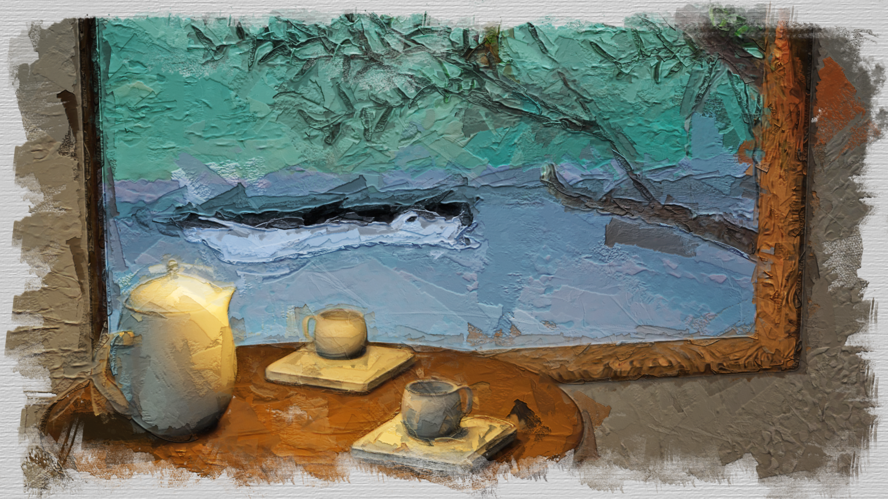

# Tearapy

Tearapy is a small game that was made for the [Cozy Fall Jam 2023](https://itch.io/jam/cozy-fall-jam-2023).

Run the game in your browser at [zahkros.itch.io/tearapy](https://zahkros.itch.io/tearapy).

Iterated on [Improve My Game Jam 46](https://itch.io/jam/improve-my-game-jam-46) in 2026.

## Changelog compared to the original version

The game was picked up again from August 29 to September 5, 2026. The jam build now has:

- A reliable customer progression system. Customers advance through three orders, completed customers leave the active rotation, and the game reaches the ending after everyone is finished. The next customer is chosen from the lowest unfinished progression level, without immediately repeating the previous customer when another eligible customer exists.
- Safer recipe checking. A tea must contain three different ingredients and must satisfy every clue revealed so far, not only the latest clue.
- Persistent state between the tea-making and tea-shop scenes. Selected ingredients are restored when returning to the shop, and each customer keeps their tea history until a new game starts. A restart also resets the unlock collection.
- A customer journal. Open the notes overlay to see the current customer's portrait, name, and served teas. Each attempt shows its ingredients and a clear accepted or rejected result.
- Ingredient progression. The player starts with ten ingredients and unlocks the rest by choosing one of two new ingredients after a successful round. Unlock choices account for the next clue so progression cannot strand the player without a required ingredient.
- A clearer ingredient-selection interface with typed ingredient data, reusable ingredient cards, distinct selection slots, locked/unlocked inventory states, card previews, and smoother hover and removal feedback.
- Dialogue and feedback polish. Accepted and rejected teas use different dialogue colors, text speed scales with the length of the message, and double-clicking reveals the current message immediately. Character and dialogue fade transitions now cancel stale tweens and block duplicate input.
- More audio feedback, including sounds for opening the journal, revealing an unlock choice, and removing an ingredient.
- Smaller, more web-friendly assets. The tracked ingredient and card PNGs were reduced from about 114.4 MiB to 21.7 MiB, and their display settings were updated to preserve the artwork's aspect ratio. Ingredient state restoration now also compares names safely across recreated data objects.
- Browser audio startup and music playback fixes. Background music starts from the Start button, satisfying the browser's user-gesture requirement, and uses a normal forward loop.
- Godot 4.7 project metadata and a GitHub Actions pipeline that exports the Web build and publishes it to itch.io from `main`.

See [DEVLOG.md](DEVLOG.md) for the full 2026 development log.
